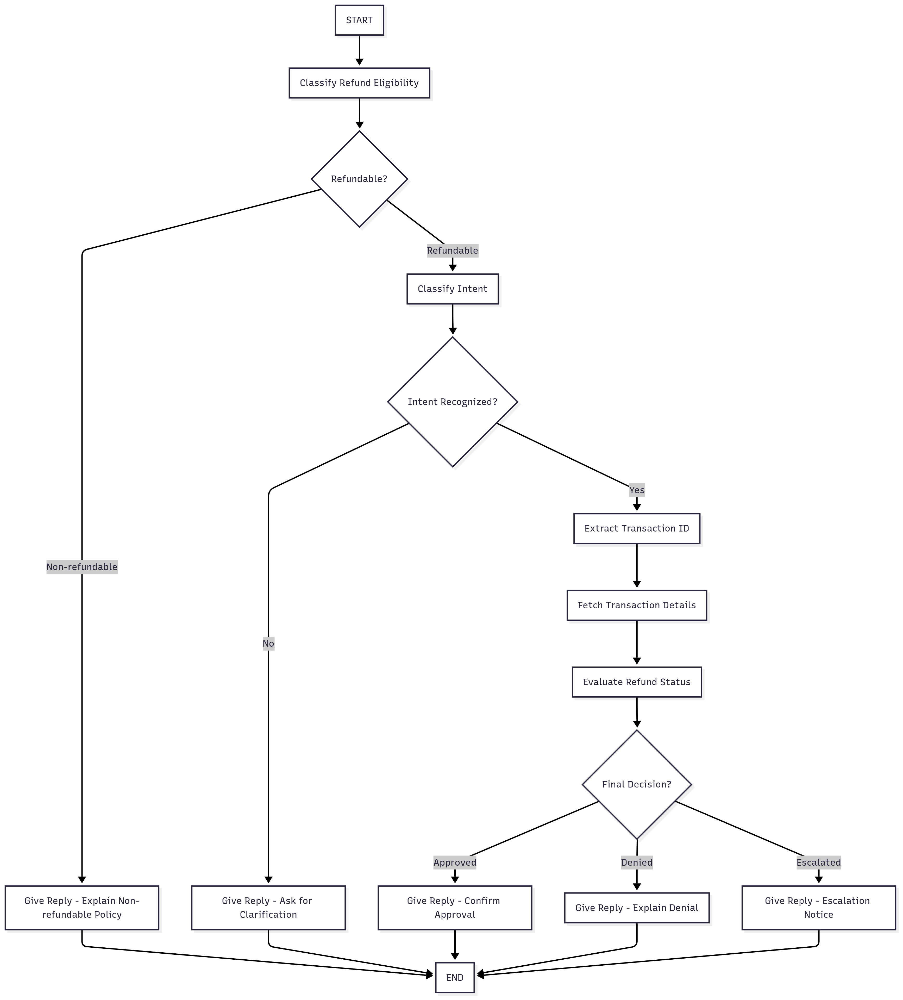

# Banking Transaction Disputes AI assistant 
---

**Automate 70% of customer refund requests** with AI that works 24/7. Eliminate costly human errors, reduce response times from hours to seconds, and **cut customer service costs.**

---

## Business Impact:

* 60-80% reduction in customer service workload
* 24/7 availability without additional staffing
* 100% consistent with companies refund policies
* Response time: 4-6 hours → under 30 seconds

---

## Perfect For:

* E-commerce businesses with high refund volumes
* Subscription services with complex policies
* SaaS companies needing 24/7 support
* Retail chains with seasonal spikes
* Any business processing substantial amount of refunds

---

## Key Features: 

✅ Natural conversation understanding  

✅ Automatic eligibility classification  

✅ Instant transaction lookup  

✅ Policy-compliant responses  

✅ Multi-turn conversation handling  

✅ Peak hour availability

---

## Workflow Chart:

## Example Workflow: 

1. **START** **→** System receives customer message
1. Classify Refund Eligibility **→** Agent analyzes message and determines this is a refund-related request
1. Refundable? **→** System checks if headphones are eligible for refunds **→** YES (Refundable)
1. Classify Intent **→** Agent determines customer wants to process a return/refund
1. Intent Recognized? **→** System confirms it understands the refund request **→** YES
1. Extract Transaction ID **→** Agent asks "Can you provide your order number?" or searches based on customer info
1. Fetch Transaction Details **→** System retrieves order information from database
1. Evaluate Refund Status **→** Agent checks purchase date, product condition, policy compliance
1. Final Decision? **→** System determines outcome **→** APPROVED
1. Give Reply - Confirm Approval **→** Agent responds: "Your refund has been approved. $89.99 will be credited to your original payment method within 3-5 business days."
1. **END** **→** Conversation completes successfully

---

**Total Process Time**: 60-90 seconds with full policy compliance and customer satisfaction     

This demonstrates how the agent handles the complete refund lifecycle **autonomously** while maintaining **accuracy** and    **professional communication.**
